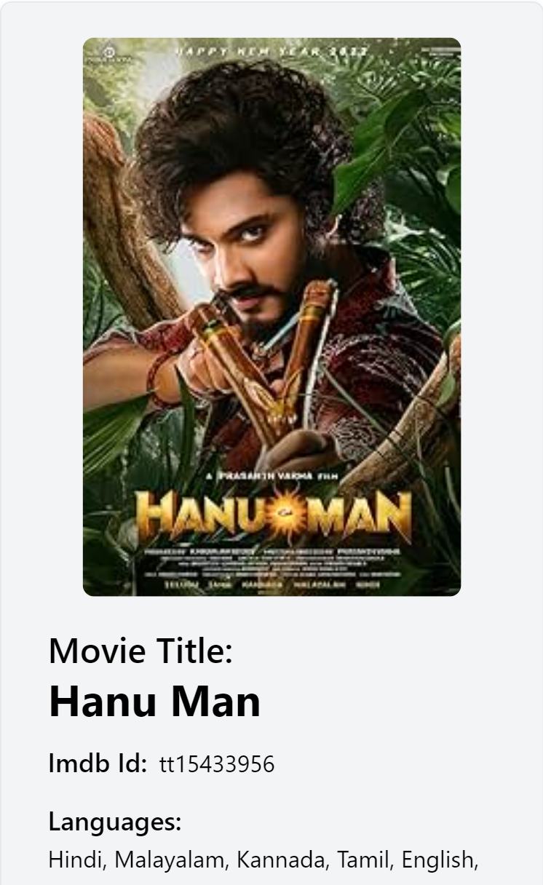

# Movie App

This is a React application that allows users to browse movies and filter them by title, genre, language, and country. The application fetches movie data from an API and displays the movies in a card format.

## Features

- Search for movies by title
- Filter movies by genre, language, and country
- Display movie details including title, IMDB ID, languages, countries, and genres
- Responsive design for different screen sizes

## Screenshots

### Desktop View


### Tablet View


### Mobile View


### Filtered Desktop View


### Filtered Mobile View


## Getting Started


```

1. Install the dependencies:

```
npm install
```

2. Start the development server:

```
npm start
```

The application should now be running at `http://localhost:3000`.

## Dependencies

This project uses the following dependencies:

- React
- react-select
- react-select/animated
- axios

## Available Scripts

In the project directory, you can run:

### `npm start`

Runs the app in the development mode. Open [http://localhost:3000](http://localhost:3000) to view it in your browser.

The page will reload when you make changes to the code. You may also see any lint errors in the console.

### `npm test`

Launches the test runner in the interactive watch mode. See the section about [running tests](https://facebook.github.io/create-react-app/docs/running-tests) for more information.

### `npm run build`

Builds the app for production to the `build` folder. It correctly bundles React in production mode and optimizes the build for the best performance.

The build is minified, and the filenames include the hashes. Your app is ready to be deployed!

See the section about [deployment](https://facebook.github.io/create-react-app/docs/deployment) for more information.

## Learn More

You can learn more in the [Create React App documentation](https://facebook.github.io/create-react-app/docs/getting-started).

To learn React, check out the [React documentation](https://reactjs.org/).

## License

This project is licensed under the [MIT License](LICENSE).